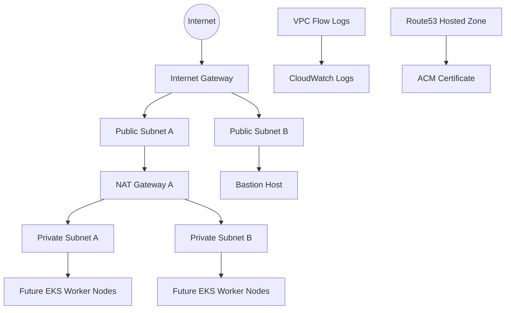

# Phase 1 Architecture: AWS Networking for EKS

This document explains why each networking component exists, how traffic moves through the VPC, and why this design is commonly used in production EKS environments.

For the full end-to-end platform architecture, including CI/CD, GitOps, observability, ingress, and workload flow, continue with `docs/Platform-Architecture.md` and `docs/Kubernetes-Internals.md`.

## High-level architecture



## ASCII architecture

```text
                                +----------------------+
                                |      Route53         |
                                |  Public Hosted Zone  |
                                +----------+-----------+
                                           |
                                           v
                                +----------------------+
                                |         ACM          |
                                | TLS Certificates     |
                                +----------------------+

   Internet
      |
      v
+-------------+         +----------------------------------------------+
|     IGW     | ------> |                    VPC                        |
+-------------+         |                10.42.0.0/16                  |
                        |                                              |
                        |  +----------------+  +----------------+      |
                        |  | Public SubnetA |  | Public SubnetB |      |
                        |  | 10.42.0.0/24   |  | 10.42.1.0/24   |      |
                        |  | NAT Gateway    |  | Bastion Host   |      |
                        |  +-------+--------+  +-------+--------+      |
                        |          |                   |               |
                        |          v                   |               |
                        |  +----------------+  +----------------+      |
                        |  | PrivateSubnetA |  | PrivateSubnetB |      |
                        |  | 10.42.10.0/24  |  | 10.42.11.0/24  |      |
                        |  | Future EKS     |  | Future EKS     |      |
                        |  | Nodes/Pods     |  | Nodes/Pods     |      |
                        |  +----------------+  +----------------+      |
                        |                                              |
                        |     VPC Flow Logs --> CloudWatch Logs        |
                        +----------------------------------------------+
```

## CIDR planning

The demo VPC uses `10.42.0.0/16`.

- Why `/16`: it gives enough address space for future subnets, pods, services, and growth.
- Why separate public and private `/24` ranges: it keeps external-facing components isolated from internal compute.
- Why leave gaps in numbering: `10.42.2.0/24` through `10.42.9.0/24` stay available for future subnets such as database, shared services, or inspection tiers.

## Public vs private subnets

Public subnets:

- Have a route to the Internet Gateway.
- Are used for resources that must receive inbound internet traffic.
- Typical examples: public load balancers, bastion hosts, NAT Gateways.

Private subnets:

- Do not have a direct route to the Internet Gateway.
- Use a NAT Gateway for outbound internet access.
- Typical examples: EKS worker nodes, application pods, databases, internal services.

## Why EKS worker nodes belong in private subnets

Worker nodes run application workloads. Putting them in private subnets reduces attack surface because they are not directly reachable from the internet. In production, inbound traffic should terminate at a managed load balancer, then be forwarded only to the workloads that need it.

## Why the NAT Gateway exists

Private instances still need outbound access for:

- Operating-system patch downloads.
- Pulling container images.
- Reaching public APIs.
- Downloading package dependencies.

The NAT Gateway gives private resources outbound internet access while still blocking unsolicited inbound internet traffic.

## Traffic flow explained

Inbound path:

1. A client reaches a public entry point such as an ALB in a public subnet.
2. The ALB forwards traffic to targets in private subnets.
3. Security groups and Network ACLs enforce traffic rules.

Outbound path from a private instance:

1. The private instance sends traffic to its private route table.
2. The private route table sends `0.0.0.0/0` to the NAT Gateway.
3. The NAT Gateway sends traffic to the Internet Gateway.
4. Return traffic is statefully tracked and returned to the private instance.

## Why both Security Groups and Network ACLs are included

Security Groups:

- Stateful.
- Attached to ENIs and instances.
- Best for workload-level access control.

Network ACLs:

- Stateless.
- Attached to subnets.
- Best for coarse subnet boundary control and compliance visibility.

Production environments often use Security Groups as the primary control and Network ACLs as a secondary coarse-grained guardrail.

## Bastion host purpose

The bastion host is a controlled administrative jump box. In modern environments it is often used only as a break-glass path, while most administration happens through AWS Systems Manager Session Manager. This repository enables the SSM role on the bastion for that reason.

## VPC Flow Logs purpose

Flow logs record accepted and rejected traffic metadata. They do not show packet payloads, but they are extremely useful for:

- Investigating connectivity failures.
- Detecting suspicious traffic.
- Supporting compliance evidence.

## Route53 and ACM purpose

Route53 manages DNS.
ACM manages TLS certificates.

Together they allow a future ingress controller to expose an HTTPS endpoint with automatic DNS-based certificate validation.

## Transit Gateway explanation

Transit Gateway is a regional network hub for connecting many VPCs, on-premises networks, and VPN or Direct Connect attachments. Enterprises use it to avoid building a large number of point-to-point VPC peerings.

## PrivateLink explanation

PrivateLink lets a consumer VPC access a service privately over AWS networking without traversing the public internet. Organizations use it to publish internal platform services, shared APIs, or third-party services securely across accounts and VPCs.

## Real-world production usage

Organizations commonly start with this exact separation of concerns:

- Shared networking team creates the VPC baseline.
- Platform team deploys EKS into private subnets.
- Security team consumes flow logs and auditing data.
- Application teams deploy workloads without needing to redesign the network.
