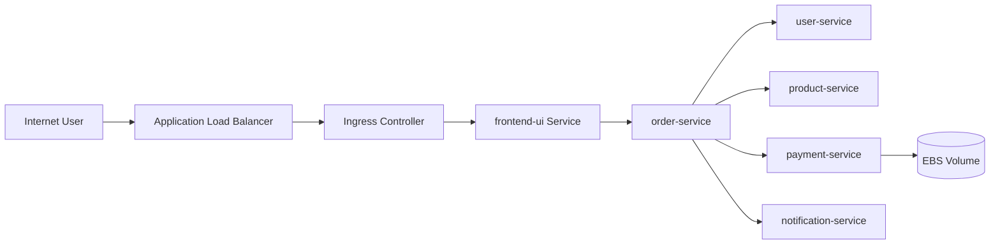
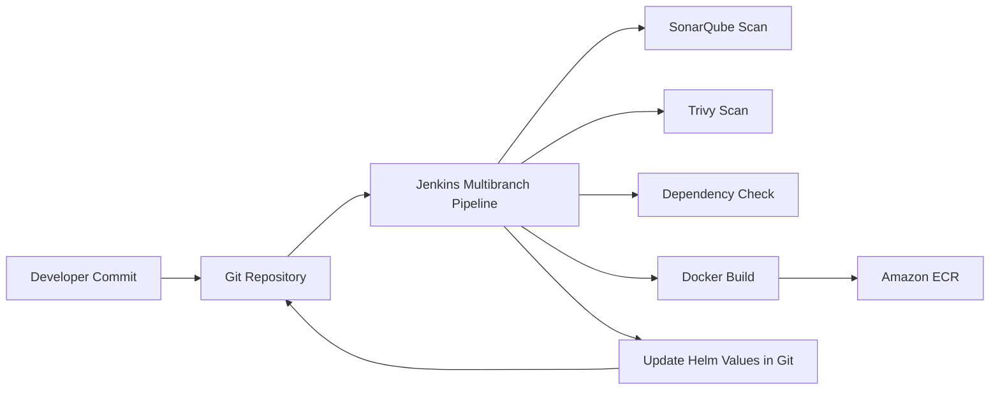
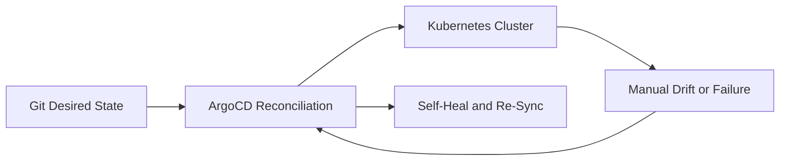
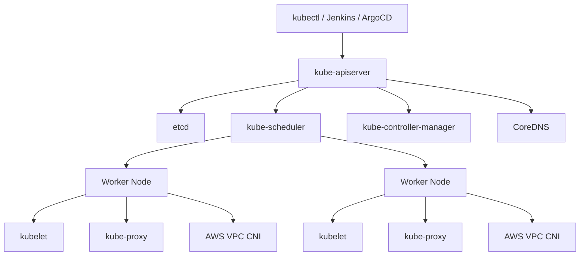

# Flow Diagrams

This document collects the main flows requested in the original prompt.

## 1. Network flow



ASCII:

```text
Internet User -> ALB -> Ingress -> Frontend -> Order -> User/Product/Payment/Notification
                                                        \
                                                         -> EBS-backed payment data
```

## 2. CI/CD flow



ASCII:

```text
Developer -> Git -> Jenkins -> Scan -> Build -> Push Image -> Commit Helm Tag -> Git
```

## 3. GitOps flow



ASCII:

```text
Git desired state -> ArgoCD -> Cluster
Cluster drift -> ArgoCD detects mismatch -> ArgoCD syncs back to Git state
```

## 4. Kubernetes internals flow



ASCII:

```text
kubectl/ArgoCD/Jenkins -> kube-apiserver -> etcd
                                 |
                                 +-> scheduler -> worker nodes
                                 +-> controller-manager
Worker nodes run kubelet, kube-proxy, and the CNI plugin
CoreDNS provides service discovery inside the cluster
```

## Why these flows matter

- Network flow explains how users reach the application.
- CI/CD flow explains how code becomes an image and then a deployment candidate.
- GitOps flow explains how Git controls the cluster state.
- Kubernetes internals flow explains how desired state becomes running pods.
