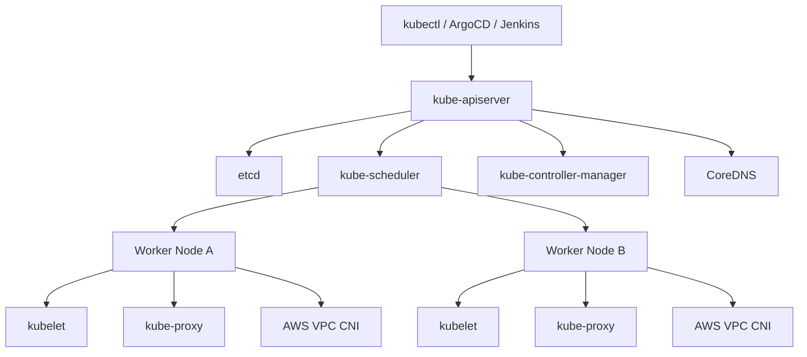

# Kubernetes Internals for Beginners

This guide explains the components behind EKS so you understand what AWS manages and what still runs inside your cluster.

## Control plane vs worker nodes

Control plane:

- `kube-apiserver` is the front door for every Kubernetes API request.
- `etcd` stores the cluster state.
- `kube-scheduler` decides which node should run each pod.
- `kube-controller-manager` runs control loops that constantly move real state toward desired state.

Worker nodes:

- `kubelet` talks to the API server and makes sure pods really run on the node.
- `kube-proxy` programs service networking rules.
- The CNI plugin gives pods IP addresses and network connectivity.
- CoreDNS provides internal DNS names such as `user-service.platform-dev.svc.cluster.local`.

## Kubernetes internals diagram



## Pod networking

In EKS with the AWS VPC CNI plugin, pods receive IP addresses from the VPC. That means pods are first-class IP endpoints on your AWS network. This simplifies integration with AWS networking and ALB target groups.

## Service networking

Services are virtual stable endpoints. They solve the problem that pod IPs change. Kubernetes creates a virtual service IP and load-balances to matching pods.

ClusterIP:
Used for internal-only communication.

NodePort:
Exposes a service on each node's IP and port.

LoadBalancer:
Asks the cloud provider to create an external or internal load balancer.

Ingress:
Adds Layer 7 routing on top of services.

## HPA vs VPA vs Cluster Autoscaler vs Karpenter

Horizontal Pod Autoscaler:
Adds or removes pod replicas based on metrics such as CPU usage.

Vertical Pod Autoscaler:
Recommends or adjusts pod CPU and memory requests. Many teams use it initially in recommendation mode to avoid surprise restarts.

Cluster Autoscaler:
Adds or removes worker nodes when pods cannot be scheduled or when nodes are underutilized.

Karpenter:
Provisions capacity more dynamically and with finer control than classic node groups. It is strong for bursty, heterogeneous, or spot-heavy workloads.

## Useful commands

```bash
kubectl get nodes -o wide
kubectl get pods -A
kubectl get deploy,statefulset,daemonset,replicaset -A
kubectl get svc,ingress -A
kubectl describe pod <pod-name> -n <namespace>
kubectl logs <pod-name> -n <namespace>
kubectl top pod -A
kubectl top node
kubectl get events -A --sort-by=.metadata.creationTimestamp
```

## Debugging commands

```bash
kubectl auth can-i get pods -n platform-dev --as system:serviceaccount:platform-dev:frontend-ui
kubectl rollout status deployment/frontend-ui -n platform-dev
kubectl rollout history deployment/frontend-ui -n platform-dev
kubectl exec -it deploy/order-service -n platform-dev -- sh
kubectl get endpoints order-service -n platform-dev
nslookup user-service.platform-dev.svc.cluster.local
```
