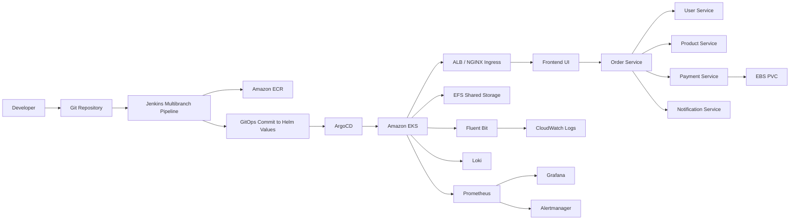

# Platform Architecture

This document explains the end-to-end enterprise architecture implemented by the repository.

## End-to-end platform diagram



## ASCII architecture

```text
Developer --> Git --> Jenkins --> ECR --> ArgoCD --> EKS --> Ingress --> Frontend
                                     |                         |
                                     |                         +--> User Service
                                     |                         +--> Product Service
                                     |                         +--> Order Service --> Payment Service --> EBS
                                     |                         +--> Notification Service
                                     |
                                     +--> GitOps commit -------+

EKS --> Prometheus --> Grafana
EKS --> Fluent Bit --> Loki
EKS --> Fluent Bit --> CloudWatch Logs
EKS --> Alertmanager
EKS --> EFS
```

## Why each major component exists

VPC:
Separates your training platform from the rest of AWS and gives you full control over addressing, routing, and security boundaries.

EKS control plane:
Runs the Kubernetes API server, scheduler, controller manager, and etcd as a managed AWS service so you do not have to operate them yourself.

Managed node groups:
Provide EC2 worker nodes for your pods while AWS manages common lifecycle tasks such as rolling replacements and version upgrades.

IRSA:
Lets pods use IAM roles without node-wide credentials. This is the standard production pattern for AWS-integrated controllers.

Helm:
Packages Kubernetes resources into reusable releases. Teams use it to standardize app deployment and configuration.

ArgoCD:
Watches Git and reconciles the cluster to the desired state stored in Git. This reduces manual kubectl drift.

Jenkins:
Builds, scans, tests, packages, and promotes changes. Many enterprises still use Jenkins for complex pipeline orchestration.

Prometheus and Grafana:
Prometheus scrapes metrics. Grafana visualizes them. Together they provide health, capacity, and performance visibility.

Loki and Fluent Bit:
Fluent Bit collects logs and ships them to Loki and CloudWatch. Loki stores logs in a Prometheus-like label model.

cert-manager and ACM:
cert-manager handles Kubernetes-native TLS. ACM handles AWS-managed certificates for ALBs and other AWS entry points.

## Production workflow

1. Developers change code in a feature branch.
2. Jenkins builds container images, runs SonarQube, Trivy, and dependency checks.
3. Jenkins pushes images to ECR and updates Helm values in Git.
4. ArgoCD detects Git drift and syncs the cluster.
5. Prometheus, Grafana, and Loki verify runtime behavior.
6. Alertmanager notifies the platform team if the release causes issues.

## Why organizations use this model

- It separates infrastructure from application delivery.
- It makes changes auditable because Git becomes the source of truth.
- It standardizes access, security, and deployment patterns across teams.
- It reduces snowflake environments and manual cluster drift.
